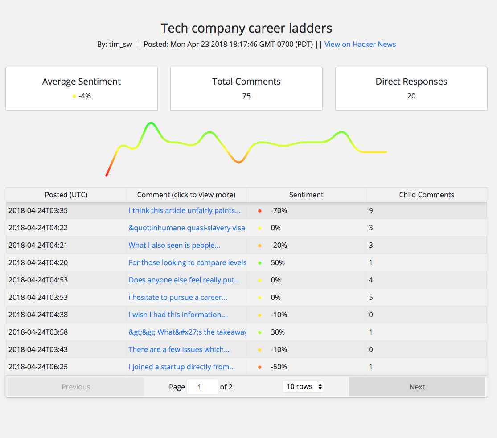

# Hacker News Sentiment Client

Live app [here](https://www.dabbl.io/)!

## About
Helps you understand how users are responding to a comment on Hacker News using natural language processing and machine learning. This client is built using React/Redux and relies on a [node server](https://github.com/ostegm/hn-sentiment-server)

## Sentiment Analysis

The main idea with this app was to pass the comments in a hacker news thread through a machine leanring model to calculate "sentiment" - a measure of how positive or negatively people responded to the original post. In the early stages of development, I relied on [Google's cloud natural language](https://cloud.google.com/natural-language/) service, but recently deployed a [custom model to GCP using TensorflowServing on Kubernetes](https://github.com/ostegm/hn-sentiment-server/tree/master/custom_model).
